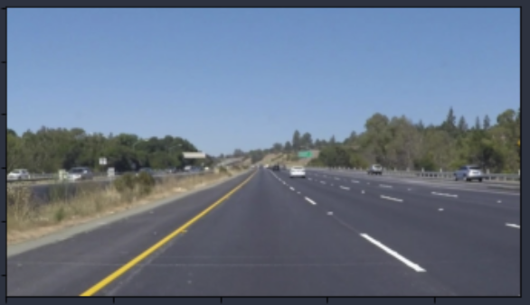

# **Finding Lane Lines on the Road** 

# Reflection

1. Describe the pipeline.

We use multiple approaches, first one using the pipeline in which we perform transforms over multiple transformations as described in the outlined pipeline:
    Raw Image -- > Convert to Grayscale --> Apply Gaussian Blur --> Find Canny Edges -->
    Detect Region of Interest --> Detect Lines using Hough Transforms --> Add lines on original image.
    
    

2. Identify any shortcomings

3. Suggest possible improvements

